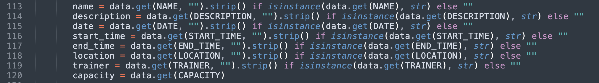
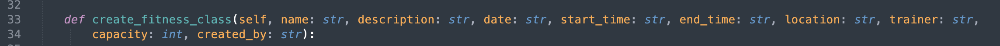
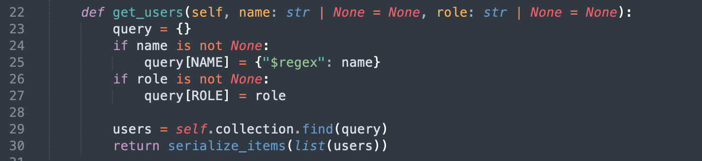
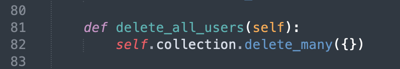
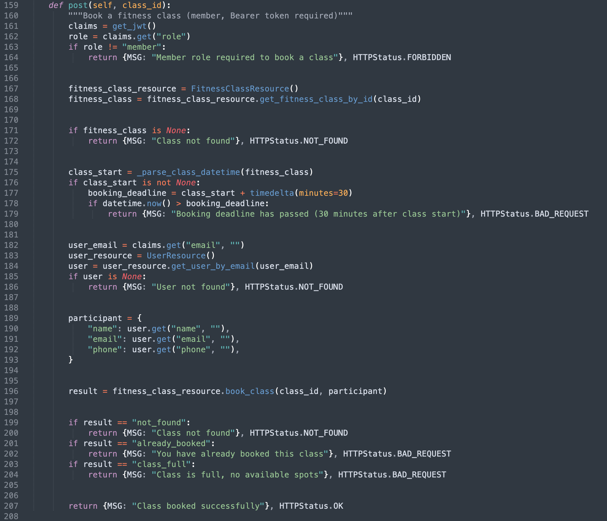

## Design Reflections – Sprint 3A


## Summary

**Tools Used:**
- *No automated tools were used.*

**Approach:**
- *We conducted manual code review in a zoom call with all of us reviewing different files*

**Team Member Responsibilities:**
|      Team Member   |     Responsibility    |
|--------------------|-----------------------|
| *Ryan Opande*      | *(TBD)*               |
| *Nelson Mbigili*   | *(TBD)*               |
| *Michael Girum*    | *(TBD)*               |
| *Paul Luziga*      | *(TBD)*               |

---

## 1 - Design Diagrams

*(Diagram to Be inserted)*

---

## 2 - Design Principle Violations

### Violation 1: *(Violation Name)*

**Principle Violated:** *(principle name)*

**File:** `path/to/file.py`
**Lines:** *(e.g., 45–78)*
**Class/Method:** `ClassName.method()`

**Description:**
*(Explain what the violation is and why it breaks the principle.)*

**Example:**
```python
# Actual code
``` 
---
## 3 – Code Smells

### Code Smell 1: *Duplicate Code*

**File:** `app/apis/classes.py`<br>
**Lines:** *(113-120)*<br>
**Method:** `FitnessClassList.post()`

**Description:**
*The same string field extraction pattern is written out seven times with only the field name changing.
This is a textbook case of duplicated code. Any logic change to how a field is extracted must be applied in seven separate places, which is error-prone and hard to maintain.*

**Screenshot:**


### Code Smell 2: *Long Parameter List*

**File:** `app/db/fitness_classes.py`<br>
**Lines:** *(33-34)*<br>
**Method:** `Fitness ClassResource.create_fitness_class()`

**Description:**
*The create_fitness_class() method accepts nine separate parameters: name, description, date, start_time, end_time, location, trainer, capacity, and created_by. A long parameter list is a code smell because it makes the method signature hard to read, easy to call with arguments in the wrong order, and difficult to extend (adding a new field like a recurrence pattern requires changing the method signature and every call site). A better approach would be to group these fields into a single data object or dictionary that is passed as one argument.*

**Screenshot:**


### Code Smell 3: *Dead Code*

**File:** `app/db/users.py` <br>
**Lines:** *(22-30, 81-82)* <br>
**Method:** `UserResource.get_users(), UserResource.delete_all_users()`

**Description:**
*Both of these methods exist in the production codebase but are never called by any API endpoint. get_users() (lines 22-30) supports filtering by name and role, but no route in app/apis/ invokes it. delete_all_users() (lines 81-82) is only referenced directly from the test suite by accessing the collection object, not through this method. We innitially added these by intuition as they may be usefull in future. However, as with any Dead code, they add maintenance burden - must be kept in sync with the rest of the system even though they deliver no value at the moment - and can create confusion about what is actually in use*

**Screenshot:**



### Code Smell 4: *Long Method*

**File:** `app/apis/classes.py`<br>
**Lines:** *(159-207)*<br>
**Method:** `BookClass.post()`  

**Description:**
*The BookClass.post() method spans 48 lines and performs multiple operations: authorization, class retrieval, deadline checking, user retrieval, participant construction, and booking. A method this long is difficult to read, test, and maintain independently. As a rule of thumb, methods should be short enough to see in one screen and do one thing well.*

**Screenshot:**


---

---


## 4 – Design Reflection on New Features
    
**New Features Being Considered:**
 >TBD


**How Current Design Helps:**
>TBD

**How Current Design Hinders:**
>TBD

**Recommendations:**
>TBD