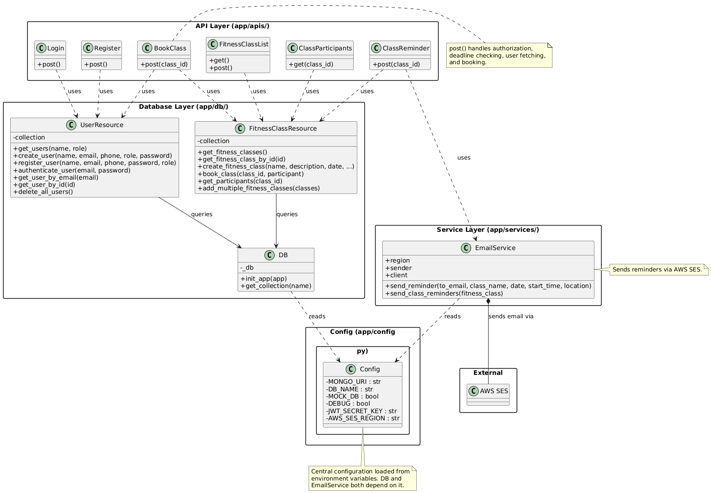
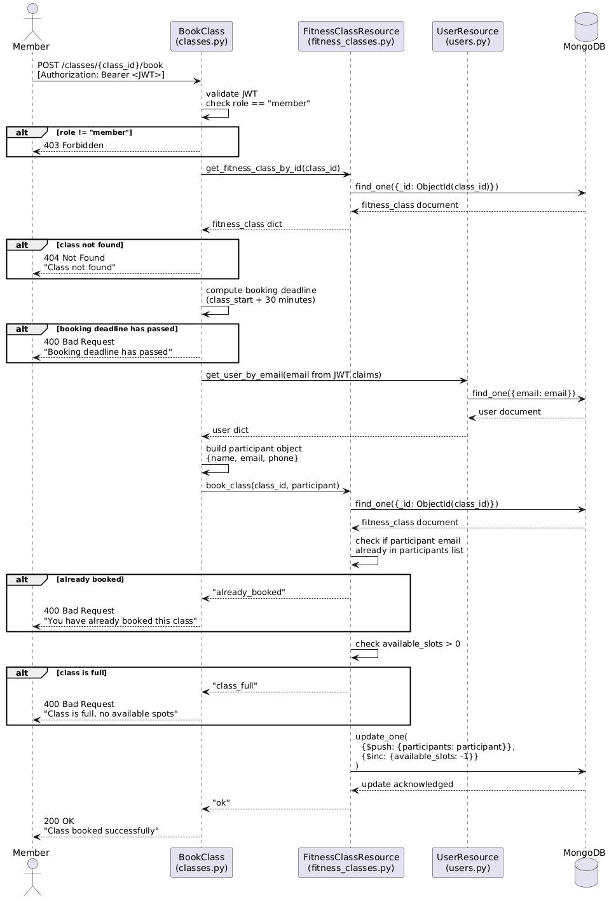
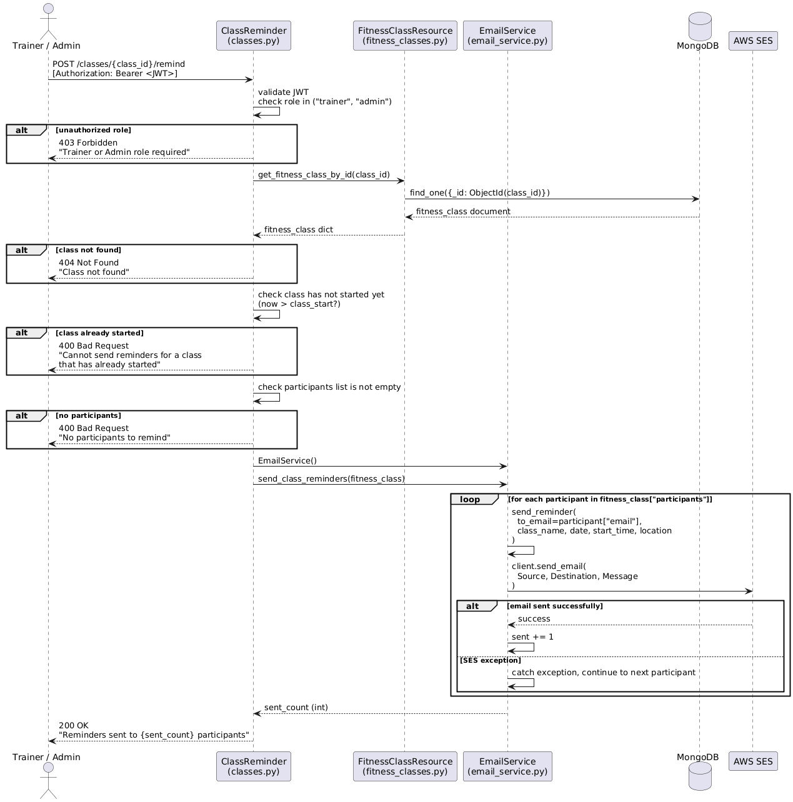
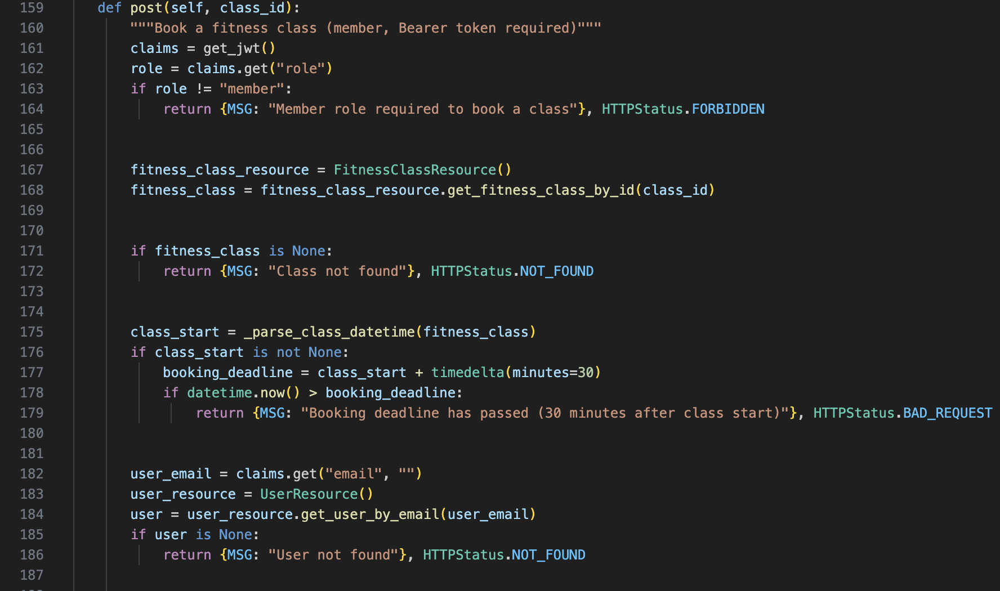
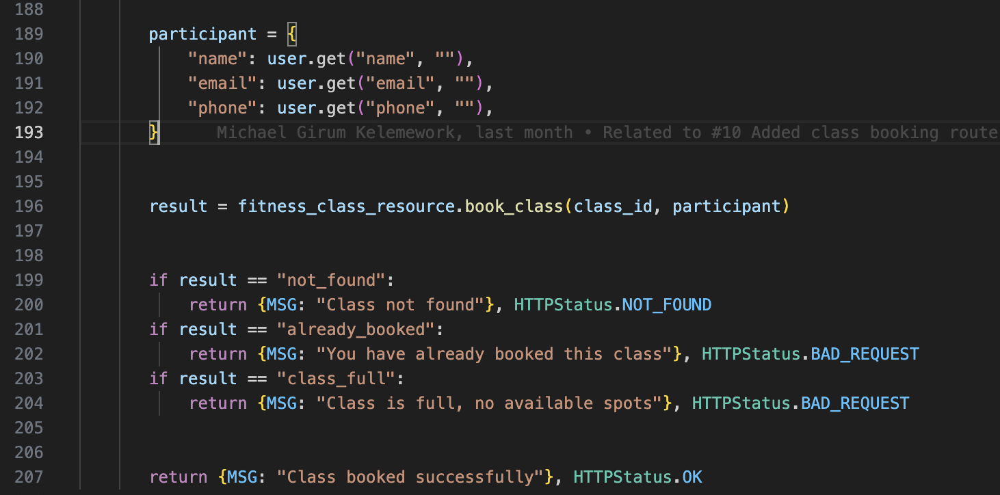
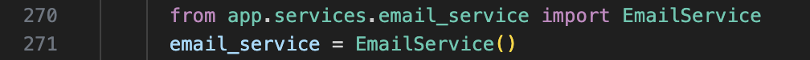
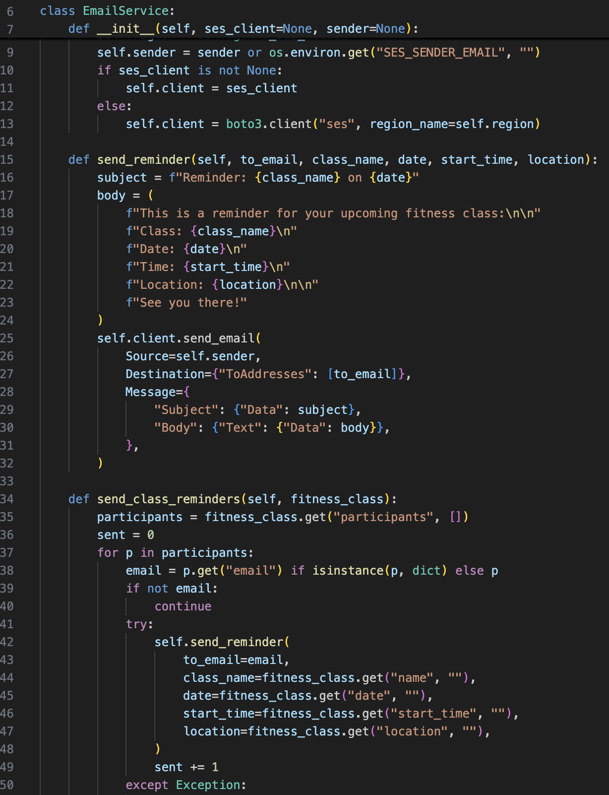
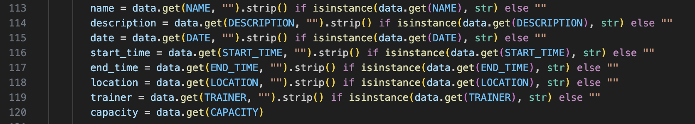
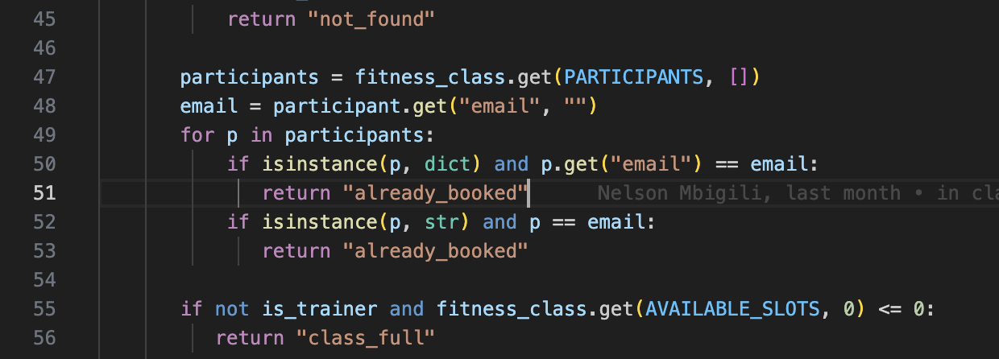
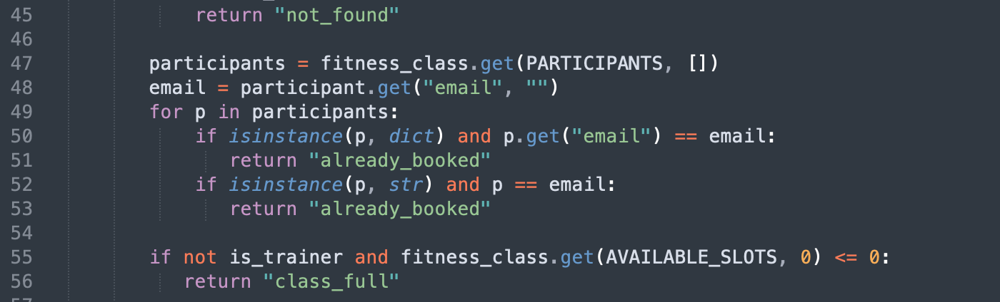

## Design Reflections – Sprint 3A

This report documents the current design of the Fitness Class Management and Booking System as part of Sprint 3A. The goal of this sprint is to analyze the existing design to prepare for the upcoming implementation of recurring classes (Feature 6) and configurable notifications (Feature 7).

## Summary

**Tools Used:**
-`pyreverse` (from the Pylint package) was used to generate an initial class diagram from the source code, which was then refined manually for clarity and accuracy.
-Planttext.com was used to produce all final UML diagrams included in this report. The diagrams files are located in `reports/files`.
-No automated code smell detection tools (e.g., SonarQube) were used. All design violations and code smells were identified through manual code review.

**Approach:**
- *We conducted manual code review in a zoom call with all of us reviewing different files*

**Team Member Responsibilities:**
|      Team Member   |     Responsibility    |
|--------------------|-----------------------|
| *Ryan Opande*      | *Code Violations, Class Diagram assistance and new features reflection*               |
| *Nelson Mbigili*   | *Code Smells, Sequence diagrams assistance and new features reflection*               |
| *Michael Girum*    | *Sequence Diagrams, Code smells assistance and new features reflection*               |
| *Paul Luziga*      | *Class Diagram, Code violations assitance and new features reflection*               |

---

## 1 - Design Diagrams
### Class Diagram
> Source file: `reports/classumldiag.png`

The diagram below shows the main classes in the system and their associations across the four layers: API, Database,Service and Config.

**Key associations:**
- The four API Resource classes (`FitnessClassList`, `BookClass`, `ClassParticipants`, `ClassReminder`) depend on `FitnessClassResource` for all class-related database operations.
- `BookClass` additionally depends on `UserResource` to retrieve the booking member's details.
- Also `Login` and `Register` depends on `UserResource` to authenticate or add a member respectively.
- `ClassReminder` depends on `EmailService` to send reminder emails.
- Both `FitnessClassResource` and `UserResource` use the `DB` class to obtain their MongoDB collections.
- `EmailService` communicates with the external AWS SES service via a boto3 client.
- `Config` handles both `EmailService` and `DB`

### Sequence Diagram for book class endpoint
> Source file: `reports/files/book_class_sequence.png`

This diagram captures the flow triggered by `POST /classes/{class_id}/book`.

**Flow summary:**
1. An authenticated Member sends a POST request with their JWT.
2. `BookClass.post()` validates the JWT and confirms the role is `"member"`.
3. The class is fetched from MongoDB via `FitnessClassResource`.
4. The booking deadline (30 minutes after class start) is checked.
5. The member's full profile is fetched from MongoDB via `UserResource`.
6. A participant object is constructed and passed to `FitnessClassResource.book_class()`.
7. `book_class()` checks for duplicate bookings and available slots, then updates MongoDB.
8. A success response is returned to the client.

---

### Sequence Diagram for remind endpoint
> Source file: `reports/files/remind_sequence_diagram.png`

This diagram captures the flow triggered by `POST /classes/{class_id}/remind`.

**Flow summary:**
1. An authenticated Trainer or Admin sends a POST request with their JWT.
2. `ClassReminder.post()` validates the JWT and confirms the role is `"trainer"` or `"admin"`.
3. The class is fetched from MongoDB via `FitnessClassResource`.
4. The system checks that the class has not yet started and that there is at least one participant.
5. An `EmailService` instance is created and `send_class_reminders()` is called.
6. `EmailService` iterates through each participant and calls `send_reminder()` for each one.
7. Each `send_reminder()` call invokes the AWS SES client. Failures for individual participants are caught and skipped.
8. The total count of successfully sent emails is returned to the client.

---

## 2 - Design Principle Violations

The following violations were identified through manual code review. They cover four distinct principles: Single Responsibility, Dependency Inversion, Open/Closed, Modularity, and Encapsulation.

### Violation 1: Single Responsibility Principle (SRP)
**File:** `app/apis/classes.py`
**Lines:** 159–207
**Method:** `BookClass.post()`

**Principle:** A class or method should have only one reason to change.

**Screenshot:**

**Violation:** The `BookClass.post()` method currently handles at least five distinct responsibilities in a single function:
1. Role authorization (lines 161–164)
2. Fetching and validating the fitness class from the database (lines 167–172)
3. Computing and checking the booking deadline (lines 175–179)
4. Fetching the user's full profile from the database (lines 182–186)
5. Constructing the participant object and performing the booking (lines 189–207)

If any one of these behaviors needs to change (e.g., the deadline window is changed, or the booking logic is updated), the entire method must be modified. These responsibilities are independent and should each have their own home for example, deadline checking and participant construction could be extracted into helper functions.

---

### Violation 2: Dependency Inversion Principle (DIP)

**File:** `app/apis/classes.py` 
**Lines:** 270–271 
**Method:** `ClassReminder.post()`

**Principle:** High-level modules should not depend on low-level modules. Both should depend on abstractions.

**Violation:** The high-level `ClassReminder` endpoint directly imports and instantiates the concrete `EmailService` class inside the method body:

**Screenshot:**

There is no abstraction between `ClassReminder` and `EmailService`. This means `ClassReminder` is directly coupled to the concrete email implementation. If we want to send reminders via a different channel (e.g., SMS), we would have to modify this method rather than simply swapping out the dependency.

---

### Violation 3: Open-Closed Principle (OCP)

**File:** `app/services/email_service.py` 
**Lines:** 6–52 
**Class:** `EmailService`

**Principle:** Classes should be open for extension but closed for modification.

**Screenshot:**

**Violation:** The `EmailService` class has no abstract base class or interface. It provides only one notification channel (email via AWS SES). Feature 7 requires users to choose between email, Telegram, SMS, and potentially other channels. Since there is no abstract `NotificationService` that other implementations could extend, adding new channels forces us to either:
- Modify `EmailService` directly (violating the "closed for modification" rule), or
- Create entirely unrelated classes with no shared contract.

A proper design would define an abstract `NotificationService` with a `send_reminder()` method, and have `EmailService`, `SMSService`, and `TelegramService` each implement it independently.

---

### Violation 4: Modularity

**File:** `app/apis/classes.py` 
**Lines:** 113–120 
**Method:** `FitnessClassList.post()`

**Principle:** Related logic should be grouped into reusable, cohesive units.

**Violation:** The same field extraction pattern is repeated seven times in sequence:

**Screenshot:**

This is not modular. The same logic (safely extract a string field and strip whitespace) is repeated inline rather than extracted into a helper function. This means if the extraction logic ever needs to change, it would have to be updated in seven places. A simple helper function like `_get_str_field(data, key)` would eliminate this repetition.

---
### Violation 5: Encapsulation

**File:** `app/db/fitness_classes.py` 
**Lines:** 45–56
**Method:** `FitnessClassResource.book_class()`

**Principle:** Internal state and implementation details should not be exposed through a class's public interface.

**Violation:** The `book_class()` method communicates its result by returning raw string codes: `"not_found"`, `"already_booked"`, `"class_full"`, and `"ok"`. The calling code in `classes.py` (lines 199–204) is then required to know and match against these specific strings:

**Screenshot:**

This leaks internal implementation details through the public interface of `FitnessClassResource`. The caller must know the exact internal string values the method may return. A better approach would be to raise domain-specific exceptions (e.g., `ClassFullError`, `AlreadyBookedError`) or return a structured result object, which would be a more encapsulated and type-safe design.

---

## 3 – Code Smells

### Code Smell 1: *Duplicate Code*

**File:** `app/apis/classes.py` 
**Lines:** *(113-120)* 
**Method:** `FitnessClassList.post()`

**Description:**
*The same string field extraction pattern is written out seven times with only the field name changing.
This is a textbook case of duplicated code. Any logic change to how a field is extracted must be applied in seven separate places, which is error-prone and hard to maintain.*

**Screenshot:**

### Code Smell 2: *Long Parameter List*

**File:** `app/db/fitness_classes.py` 
**Lines:** *(33-34)* 
**Method:** `Fitness ClassResource.create_fitness_class()`

**Description:**
*The create_fitness_class() method accepts nine separate parameters: name, description, date, start_time, end_time, location, trainer, capacity, and created_by. A long parameter list is a code smell because it makes the method signature hard to read, easy to call with arguments in the wrong order, and difficult to extend (adding a new field like a recurrence pattern requires changing the method signature and every call site). A better approach would be to group these fields into a single data object or dictionary that is passed as one argument.*

**Screenshot:**

### Code Smell 3: *Dead Code*

**File:** `app/db/users.py`  
**Lines:** *(22-30, 81-82)*  
**Method:** `UserResource.get_users(), UserResource.delete_all_users()`

**Description:**
*Both of these methods exist in the production codebase but are never called by any API endpoint. get_users() (lines 22-30) supports filtering by name and role, but no route in app/apis/ invokes it. delete_all_users() (lines 81-82) is only referenced directly from the test suite by accessing the collection object, not through this method. We innitially added these by intuition as they may be usefull in future. However, as with any Dead code, they add maintenance burden - must be kept in sync with the rest of the system even though they deliver no value at the moment - and can create confusion about what is actually in use*

**Screenshot:**

### Code Smell 4: *Long Method*

**File:** `app/apis/classes.py` 
**Lines:** *(159-207)* 
**Method:** `BookClass.post()`  

**Description:**
*The BookClass.post() method spans 48 lines and performs multiple operations: authorization, class retrieval, deadline checking, user retrieval, participant construction, and booking. A method this long is difficult to read, test, and maintain independently. As a rule of thumb, methods should be short enough to see in one screen and do one thing well.*

**Screenshot:**

### Code Smell 5: *Primitive Obsession*

**File:** `app/db/fitness_classes.py` 
**Lines:** *(45-56)* 
**Method:** `Fitness ClassResource.book_class()`

**Description:**
*The method returns plain strings ("not_found", "already_booked", "class_full", "ok") to represent what are fundamentally distinct error states. Using primitive string values to encode domair concepts is a classic smell. It prevents the compiler/interpreter from catching typos, makes the interface harder to document, and forces callers to perform string comparisons rather than handling typed exceptions or result objects.*

**Screenshot:**

---

---

## 4 – Design Reflection on New Features
### Feature 6: Create Recurring Class

Feature 6 requires trainers to create a class once and have it automatically repeat (e.g., daily or weekly). The current design does not support this, and our analysis reveals several ways the existing system will hinder its implementation.

The `create_fitness_class()` method in `fitness_classes.py` (lines 33–40) creates exactly one class document per call. There is no concept of a recurrence pattern in the data model. To support recurring classes, we would need to either generate multiple individual class documents at creation time or introduce a new `RecurringClass` document type and a mechanism to instantiate future occurrences. Neither approach is supported by the current schema.

Furthermore, the `FitnessClassList.post()` method already suffers from the modularity violation identified in Task 2 — it is bloated with inline validation. Adding recurrence parameters (e.g., frequency, end date) to an already dense method will make it significantly harder to read and maintain.

The Single Responsibility violation in `FitnessClassList.post()` is the most directly harmful here: the method already mixes validation, authorization, date parsing, and class creation. Adding a branching code path for recurrence generation will compound this problem.

### Feature 7: Configure Notifications

Feature 7 requires registered users to choose how they receive reminders (email, Telegram, SMS, etc.). This is where the current design is most significantly lacking.

The most critical issue is the absence of a `NotificationService` abstraction (Violation 3 — OCP). Currently, `EmailService` is the only notification mechanism and there is no shared interface. Adding SMS or Telegram support means creating new classes with no common contract, making it difficult to treat them interchangeably.

The DIP violation in `ClassReminder.post()` (Violation 2) compounds this: the endpoint directly instantiates `EmailService`, so even if we create new notification service classes, the endpoint will not know how to select between them without modification.

There is also no field in the `User` model to store notification preferences. The participants stored in a fitness class only contain `name`, `email`, and `phone`. We would need to add a `notification_channels` field (or similar) to the user schema and propagate it into the participant record at booking time.

In summary, Feature 7 is the more disruptive of the two. The current design was built around a single, hardcoded notification channel and will require structural changes specifically, introducing a notification abstraction layer and updating the user and participant data models before multiple notification channels can be added in a clean and extensible way.
