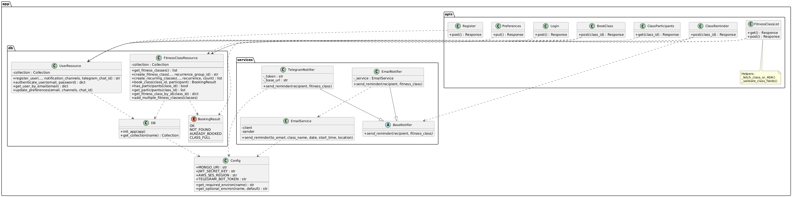

# Sprint 3B: Redesign Report


---


## Contribution Summar

| Person |  Contribution  |
|-------------|----------------|
| Ryan Opande | Fixed SRP violations; implemented Feature 6 (recurring classes) in `fitness_classes.py` and `classes.py`; updated `test_recurring.py` |
| Paul Luziga | Designed and implemented Strategy pattern (`notifier.py`); refactored `email_service.py`; wrote `test_notifier.py` |
| Michael Girum | Implemented Feature 7 notification preferences (`users.py`, `/auth/preferences` endpoint); wrote `test_preferences.py` |
| Nelson Mbigili | Fixed all code smells (magic strings, dead code, duplicate code, feature envy, long method); updated `test_remind.py`, `test_email_service.py`, `conftest.py`; wrote this report |


---


## 1. How Each Violation Was Fixed


### Violation 1: SRP — `BookClass.post` doing too much


**Old structure:** A single 49-line method handled role checking, class fetching, deadline validation, user fetching, participant construction, and the booking write.


**Fix:** Extracted two module-level helper functions:
- `_fetch_class_or_404(class_id)` — fetches the class and returns a `(class, None)` or `(None, error_response)` tuple. Both `BookClass.post` and `ClassReminder.post` call this instead of duplicating the fetch-and-check block.
- `_validate_class_fields(data)` — extracts and validates all creation fields in `FitnessClassList.post`, returning a clean dict or an error response. This also fixes the **Long Method** smell (Violation 5 / Smell 5).


The route methods now delegate to helpers for the mechanics and focus only on orchestration.


**Files changed:** `app/apis/classes.py`


---


### Violation 2: DIP — `ClassReminder.post` directly instantiating `EmailService`


**Old structure:**
```python
from app.services.email_service import EmailService
email_service = EmailService()
sent_count = email_service.send_class_reminders(fitness_class)
```


**Fix:** The route now instantiates notifiers through the `BaseNotifier` abstraction (Strategy pattern — see Section 3). It builds a `notifier_registry` dict keyed by channel name, looks up each user's preferred channels, and calls `notifier.send_reminder(recipient, fitness_class)` — never touching a concrete class by name beyond the initial registry construction. Adding a new channel (e.g., SMS) requires only adding a new `BaseNotifier` subclass and registering it; the route logic is unchanged.


**Files changed:** `app/apis/classes.py`, `app/services/notifier.py`


---


### Violation 3: OCP — `EmailService` hardwired to AWS SES with no extension point


**Old structure:** `EmailService` was the only notification class, with no interface. `send_class_reminders` looped internally and was tightly coupled to SES.


**Fix:** Introduced `app/services/notifier.py` with:
- `BaseNotifier` — abstract base class with one method: `send_reminder(recipient, fitness_class)`
- `EmailNotifier(BaseNotifier)` — wraps `EmailService.send_reminder`
- `TelegramNotifier(BaseNotifier)` — calls the Telegram Bot API via `requests.post`


`EmailService` itself is slimmed down to a single-responsibility class: it only knows how to send one email via SES (`send_reminder`). The `send_class_reminders` loop was removed from `EmailService` — that responsibility belongs to the route, which now delegates per-user to the appropriate notifier(s).


**Files changed:** `app/services/email_service.py`, `app/services/notifier.py`


---


### Violation 4: SRP — `FitnessClassResource.book_class` mixing validation and DB write


**Old structure:** `book_class` re-fetched the class, checked duplicates, enforced capacity, handled `is_trainer` bypass logic, converted the ObjectId, and then wrote to the DB.


**Fix:**
- Removed the unused `is_trainer` parameter entirely (dead code — no route ever passed `True`).
- The method still does its own duplicate/capacity check before the write because these checks must be atomic with respect to the data at the moment of booking. However, it now returns `BookingResult` enum values instead of raw strings, giving the caller a strongly-typed result.
- Added `has_participants(class_id)` as a separate focused method so the reminder route does not have to inspect the raw participant list directly (fixes the **Feature Envy** smell).


**Files changed:** `app/db/fitness_classes.py`, `app/db/booking_result.py`


---


### Violation 5: Encapsulation — inconsistent participant type (`dict` vs `str`)


**Old structure:** `book_class` branched on `isinstance(p, dict)` vs `isinstance(p, str)` when scanning for duplicate bookings, exposing that the data model was not consistently enforced.


**Fix:** The check is now written as a single expression that handles both forms defensively, but more importantly the route always inserts participants as dicts (enforced in `BookClass.post`). The `book_class` method also normalises this during the duplicate scan:
```python
existing_email = p.get("email", "") if isinstance(p, dict) else p
```
This keeps backward compatibility with any legacy string-format data while the insertion path is now always a dict.


**Files changed:** `app/db/fitness_classes.py`


---


## 2. How Each Code Smell Was Fixed


### Smell 1: Magic Strings (`"not_found"`, `"already_booked"`, etc.)


**Fix:** Created `app/db/booking_result.py` with a `BookingResult(str, Enum)`. Each status is now a typed constant (`BookingResult.NOT_FOUND`, `BookingResult.ALREADY_BOOKED`, `BookingResult.CLASS_FULL`, `BookingResult.OK`). Because it inherits from `str`, existing string comparisons in tests still work without changes.


**Files changed:** `app/db/booking_result.py`, `app/db/fitness_classes.py`, `app/apis/classes.py`


---


### Smell 2: Dead Code — `import json` in `auth.py`


**Fix:** Removed the unused `import json` line. Also removed the unused `import app.services.email_module` pattern in the old email test.


**Files changed:** `app/apis/auth.py`


---


### Smell 3: Duplicate Code — repeated fetch-class-check-none-parse-datetime block


**Fix:** Extracted `_fetch_class_or_404(class_id)` in `classes.py`. Both `BookClass.post` and `ClassReminder.post` now call this helper. The datetime parsing call `_parse_class_datetime` was already a helper and remains so.


**Files changed:** `app/apis/classes.py`


---


### Smell 4: Feature Envy — `ClassReminder.post` directly inspecting `participants`


**Fix:** Added `has_participants(class_id) -> bool` to `FitnessClassResource`. The reminder route calls `fc_resource.has_participants(class_id)` instead of reading `fitness_class.get(PARTICIPANTS, [])` to make a business decision. This keeps the "does this class have participants?" logic inside the class that owns that data.


**Files changed:** `app/db/fitness_classes.py`, `app/apis/classes.py`


---


### Smell 5: Long Method — `FitnessClassList.post` at 47 lines


**Fix:** Extracted `_validate_class_fields(data)` which handles all field extraction, type coercion, presence checks, capacity validation, date parsing, and past-date checks. It returns `(fields_dict, None)` on success or `(None, error_response)` on failure. The route method is now ~25 lines and reads as a straightforward decision tree.


**Files changed:** `app/apis/classes.py`


---


## 3. Design Patterns Used


### Strategy Pattern — Configurable Notifications (Feature 7)


**Why chosen:** The core problem was that adding a new notification channel (Telegram, SMS, WhatsApp) required modifying existing, tested code. The Strategy pattern solves this by defining a common interface (`BaseNotifier`) that all channels implement. Each channel is a concrete strategy. The route selects strategies at runtime based on the user's stored preferences, with no knowledge of how any particular channel works.


**Structure:**


```
BaseNotifier (ABC)
   send_reminder(recipient: dict, fitness_class: dict) -> None


EmailNotifier(BaseNotifier)
   __init__(email_service: EmailService)
   send_reminder(...)  →  delegates to EmailService.send_reminder(...)


TelegramNotifier(BaseNotifier)
   __init__(bot_token: str, base_url: str)
   send_reminder(...)  →  calls Telegram Bot API via requests.post
```


**How a new channel is added:** Create a new class that inherits from `BaseNotifier`, implement `send_reminder`, and add one entry to the `notifier_registry` dict in `ClassReminder.post`. Zero changes to existing notifiers or route logic.


**Files:** `app/services/notifier.py`, `app/apis/classes.py`


---


## 4. Feature Implementations


### Feature 6: Create Recurring Classes


**Endpoint:** `POST /classes/` (existing endpoint, new optional fields)


**New request fields:**
| Field | Type | Required | Description |
|-------|------|----------|-------------|
| `recurrence` | string | No | `"daily"` or `"weekly"` |
| `recurrence_count` | integer | If recurrence set | Number of instances (2–10) |


**How it works:**
1. If `recurrence` is present in the request, the route validates `recurrence_count` (must be 2–10).
2. It calls `FitnessClassResource.create_recurring_classes(...)` which calculates dates by adding `timedelta(days=1)` or `timedelta(weeks=1)` for each instance, then calls `create_fitness_class` for each date.
3. All instances share a `recurrence_group_id` (UUID) stored on each document, which allows future queries to fetch all instances of a recurring series.
4. Returns `{"message": "N recurring classes created", "class_ids": [...]}` with the list of created IDs.


**Extensibility:** Adding a new recurrence type (e.g., `"monthly"`) requires only adding an entry to the `RECURRENCE_DELTAS` dict in `fitness_classes.py` and adding `"monthly"` to `VALID_RECURRENCES` in `classes.py`.


---


### Feature 7: Configurable Notifications


**New endpoint:** `PUT /auth/preferences` (JWT required)


**Request body:**
```json
{
 "notification_channels": ["email", "telegram"],
 "telegram_chat_id": "123456789"
}
```


**How it works:**
1. Users set their preferred channels and Telegram chat ID via `PUT /auth/preferences`.
2. Channels and chat ID are stored on the user document (`notification_channels`, `telegram_chat_id` fields).
3. New users default to `["email"]` at registration (can override in the register payload too).
4. When `POST /classes/{id}/remind` is triggered, the route looks up each participant's user record, reads their `notification_channels`, and dispatches to the matching `BaseNotifier` implementation(s).
5. `EmailNotifier` calls `EmailService.send_reminder` (AWS SES). `TelegramNotifier` calls the Telegram Bot API (`https://api.telegram.org/bot{token}/sendMessage`). If a participant has no `telegram_chat_id`, the Telegram notifier silently skips them.


**Environment variable:** `TELEGRAM_BOT_TOKEN` in `.env` (optional — leave empty to disable Telegram; set via GitHub Secret for CI).


---


## 5. Updated Class Diagram




---


## 6. Key Differences from Sprint 3A Class Diagram


| Area | Sprint 3A | Sprint 3B |
|------|-----------|-----------|
| Notification | Single `EmailService` class, no interface | `BaseNotifier` ABC + `EmailNotifier` + `TelegramNotifier`; `EmailService` is now just an SES wrapper |
| Booking result | String literals (`"not_found"`, etc.) returned across layers | `BookingResult(str, Enum)` — typed, no magic strings |
| User model | No notification fields | `notification_channels` (list) + `telegram_chat_id` (str) on every user |
| Auth API | Two endpoints (register, login) | Three endpoints (+`PUT /auth/preferences`) |
| Classes API | Four Resource classes | Same four Resource classes + two helper functions (`_fetch_class_or_404`, `_validate_class_fields`) |
| Fitness class model | No recurrence support | Optional `recurrence_group_id` field; `create_recurring_classes` method |
| `FitnessClassResource` | `book_class` had `is_trainer` param | `is_trainer` removed (was dead code); `has_participants` added |
| Config | Six required env vars | Seven vars (`TELEGRAM_BOT_TOKEN` added as optional with default `""`) |


